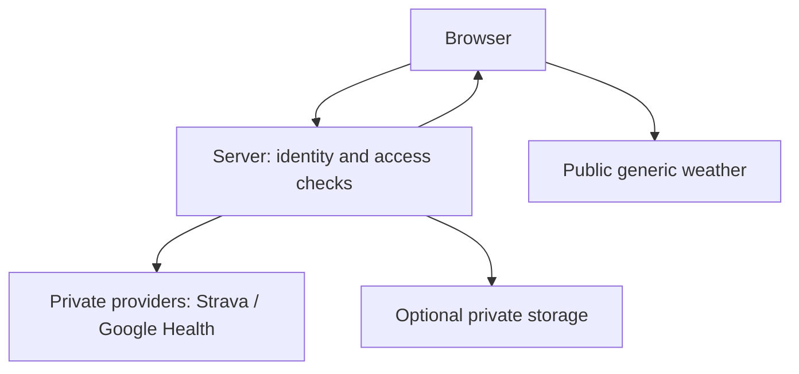

# Lesson 5 connector map

For lesson/publication status see [the application tracker](APPLICATION_TRACKER.md#current-status). Dated first-party checks and their limitations are in [the codebook](CODEBOOK.md#lesson-5-source-check-2026-10-02).

## Three different jobs

| Part | Job in Cycle Signals |
| --- | --- |
| Static hosting (GitHub Pages) | Deliver HTML, CSS and browser JavaScript. All delivered content is inspectable. |
| Server runtime (candidate: Worker) | Execute code: authenticate the requester, authorize access, call providers privately, validate and return approved fields. |
| Database (candidate: D1) | Persist agreed information between requests. Storage does not replace access checks. |

Proposed future boundary, not an activated integration:

The server returns only approved summaries. Provider secrets never travel back to the browser. A hidden token alone does not prevent a public endpoint from leaking its response; CORS is not authentication.

## Minimum candidate signals

| Connector | Needed result | Boundary / unresolved requirement |
| --- | --- | --- |
| Open-Meteo | Numeric WMO weather code for the existing generic London request | Existing public request contains no secret. Preserve coarse coordinates and attribution; historical matching is a later lesson. |
| Strava | Ride duration in seconds; ride type for filtering | Server OAuth. Reference offers elapsed and moving duration; choose the meaning before Lesson 7 rather than silently treating them as equal. Exact dates for later matching stay private. App creation requires subscription; Ronan's eligibility is unverified. |
| Fitbit / Google Health | Prior-night sleep duration in hours; any activity summary separately agreed | **Needs re-check.** Legacy Fitbit shuts off 2026-10-30; Google is not onboarding new projects. Verify access, scopes, replacement sleep fields, units and day boundaries. Lesson 8 may use fixtures or need redesign. |

Do not request routes, GPS streams, home/work coordinates, activity names, detailed sleep stages or unrelated health measures. Provider responses may contain extra fields: discard them before storage or display. No real source data belongs in the repository.

## Server comparison

| Candidate | What fits | Trade-off |
| --- | --- | --- |
| Cloudflare Workers + D1 | Server code and optional persistent store together; published Free quotas | Leading candidate only. Check account access, regional/privacy requirements and limits before activation. |
| Vercel Hobby functions + separate store | Personal, non-commercial function hosting | Requires a separate persistence choice and its privacy/cost review. |
| Supabase Free | Database with Edge Functions and authentication tools | More platform surface to configure; confirm current function quotas, inactivity behavior and account terms before selection. |

A free backend does not make subscription-gated provider access free. Keep the course at $0; do not buy a subscription or enable billing to satisfy this map.

## Data leaving the browser and retention

| Flow | Recipient / minimum information | Retention assumption |
| --- | --- | --- |
| Existing page request | Static host receives ordinary request/network metadata | Host logging retention has not been reviewed; no private source data sent. |
| Existing weather request | Open-Meteo receives generic coordinates, requested field and network metadata | Provider privacy/retention must be reviewed before any new location flow. No personal coordinates introduced. |
| Future private dashboard request | Server receives session identity; returns authorized minimal summary | No real-data flow activated. Session/log retention and response caching remain to be designed. |
| Future server-to-provider request | Provider receives scoped authorization and necessary query parameters | Consent, revocation and deletion rules must be reviewed before connection. |
| Optional storage | Server-controlled store receives only agreed minimum | Retention period, token protection, backup expiry and deletion remain undecided; never assume indefinite retention is acceptable. |

Before activation, define rate limits, bounded caching (never publicly cache private responses), quota monitoring and a shutoff switch. No account, credential, storage or billing was enabled for this lesson.

## Before Lesson 6

Resolve the [open decisions](PROJECT_BRIEF.md#open-decisions-before-lesson-6): real dashboard audience, endpoint access protection, and replacement sleep-source feasibility. Lesson 6 begins with teaching the request/response boundary and a concept check, then a synthetic-only endpoint. These answers do not authorize account connections.
